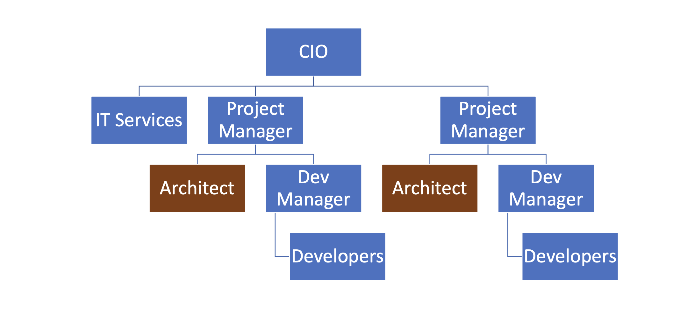
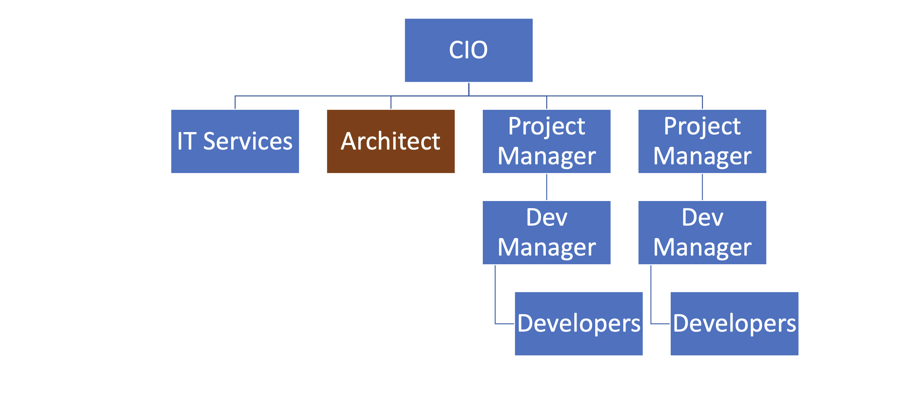

## The Complete Guide to Becoming a Software Architect
### SECTION 1 : What is a software Architect
1. Types of Architects
    * **Infrastructure Architect**  
        The infrastructural architect is responsible for designing the infrastructure of a given system, and by infrastructure, I mean all the Nan Software related elements such as servers, virtual machines, network storage, etc. 
        He's responsible for all this and also to make sure they work nicely with the system, developed the infrastructure architecture to be familiar with the systems requirements so he can make sure the infrastructure he designs will support those requirements.
        For example, if the system is expected to grow by three terabytes annually, the infrastructure architect should make sure the storage for the system will be able to handle this load. The career path for infrastructure architect goes through infrastructure experts. You have to be well versed in infrastructure, design, implementation and configuration in order to become a good infrastructure architect.
    * **Software Architect**  
        the software architect sometimes called also solution architect or system architect, is responsible for the architecture of the software
    * **Enterprise Architect**  
        the enterprise architect Rook's, with the top management of the organization to make sure the idea of the organization is an enabler for the business and not a hindrance.
        In many organizations, business decisions such as starting a new sale or entering a new business field, is held back by the ATI, which needs time to adapt to the new requirements. The enterprise architect usually walks with the CEO and CIO of the organization to find out what are the main bottlenecks, what holds back the waiting and how it can be streamlined to support business continuity.
        Since the enterprise architect operates at a very high level in the organization, he has almost no work relations with development oriented roles such as developers and team leaders. In order to become an enterprise architect, one has to be first a senior software architect or an experienced project manager. As I said earlier, the enterprise architect is not very technical, and you don't always have to have a practical hands on experience in order to become one, although it's definitely a plus.
2. Responsibility of the Architect  
    What do we need an architect at all? 
    The short answer is this developer knows what can be done.
    Architect knows what should be done.
    A senior developer knows the technology very well, knows what is the best way to implement loops, how to perform operations efficiently, what libraries to use to access a database, and so on. A software architect is also quite familiar with the technology platform, although not as much as a developer. But his main goal is to make sure the software design implements the requirements of the system.  
    **a software architect is someone who designed the system to be fast, secure, reliable and easy to maintain and select the optimal technology platforms and patterns to achieve these goals.**
3. The Architect in the Organization Chart  
    I want to emphasize a point architect is not and should not be a managerial position. S/he does not hire and fire. S/he does not manage vacation requests and definitely not conducting performance reviews or compensation negotiations. The reason for that is that the architect is a professional and has a lot to deal with. It is not a good idea to mix all her responsibilities with management tasks.
    
    The first chart demonstrate an organization chart with a dedicated architect for each project.  
      
    This is a typical, though very simplified chart with the architects are junior ones. In this scenario, the architect sees the bigger picture, but only of the project they are not involved with. Other project is organization and the contribution is quite limited.

    The second chart demonstrate architect reports directly to the CIO.
      
    This is usually the case with senior experienced architects, which have proven themselves valuable to the organization and which has a tremendous added value at the organization level and not just the project level.
4. Architects & Code
    * Architectural trustworthiness as an architect.  
        You are going to design an architecture which utilizes certain platforms in patterns, you have to make sure the architecture is feasible and the best way to do it is to try and implement it yourself.
        Yes, that's not a mistake. You have to be able to implement certain parts of the architecture in order to test them before expecting the developers to implement the unimplementable.  
        **for example.**  
            Are you going to recommend using a certain dependency injection package tested in a small application and make sure it's actually do what you expect it to do? Are you contemplating whether to use analytical database or stick with a traditional RDBMS? No problem, installed both on your machine and test them out. This is the only way to make the architecture trustworthy by testing it beforehand to ensure your design can be implemented effectively and easily support the developers.
    * Support the Developers  
        One of the hardest tasks of the architect is to make sure the architecture is actually implemented. The best way to do that is to provide an ongoing support to the developers. The architect must be able to help developers when they get stuck while implementing the architecture and Ximenes, the developers work to detect deviations from the intended implementation. If the architect does not possess coding skills, he won't be able to review the code and locate those deviations.
    * Respect  
        If the architect is perceived as someone who has no idea what the developers are actually doing, they will think of him as a snob, arrogant and detached, and will immediately lose respect for him. If, on the other hand, they will see you sitting with them, helping them solve problems and listening to them, they will appreciate you as a down to earth practical and an all around nice guy and will be more than happy to listen to you in the future and discussing architectural topics and tasks.
5. Architects & the Academy
    * No dedicated degree for Architecture
    * CS Degree won’t hurt
    * Some courses and certifications exist (TOGAF etc.)
    * Usually geared towards Enterprise Architecture
6. Career Path for Architect
    The Common path for be architect
  
### SECTION 2 : The Architect’s Mindset  
1. Understand the Business  
    The really important lesson here is that in order to be of any value to the organization, you have to have a deep understanding of the organizations business.
    You have to understand what its **weaknesses** and **strengths** are. Who are they **competing** with in what is a **growth strategy**?  
    always understand the business before you begin walking on the architecture.
2. The System’s Goals  
    Now, it's important to note we are not talking here about what the system should do.
    These are not goals.  These are requirements.  
    And it's important to distinguish one from the other when talking about goals. We are talking about the effect the system will have on the organization. This effect can be almost anything, but it should be clear how this will affect the bottom line of the organization.  
    **We must know what is the environment our system is going to be operating in and what are the main tasks**  
    * Example 1
        System : HR System  
        Organization:  Product-Oriented Company  
        Goals: Streamline the Recruitment Process 
    * Example 2:
        System: Reporting & Mapping Criminal Incidents
        Organization: Large City
        Goal(s): 1. Improve Police’s Response Time, 2. Attract New Residents
    * Example 3:
        System: Mobile Flash Sales
        Organization: Young & Small Startup
        Goal(s): 1. Generate Quick Revenue Stream, 2. Attract Investors
3. Your Client’s Clients  
    It means that your mindset should be geared towards your client's client. It means that with every decision you make, you must ask yourself what will be the effect of this decision on your client client? It means that the comfort of your client's client is prioritized over the comfort of your client.
4. Watch Your Language  
    always keeping in mind what is the thing that really matters to the person you are talking to. If you can adapt to language to the best interests of the person we are talking to, you will be able to achieve much more.
    **Example the project manager** :  
        Sophie, because only for the project success, she doesn't care what technology will be used or how amazing the architecture is. When you talk to her about your plans for the architectural, always emphasize how it will contribute to the project's success.
    Avoid sentences like this is the latest and greatest pattern and will be the first to test it out.  
    This sentence will only frighten her and she will immediately imagine how this untested technology will cause delays and compromises down the road.  
    Instead, try something along the lines of this.
    New technology can help us write the code twice as fast so we can cut our schedule and budget accordingly.  
    **Example the Team Leader** :
    That is a hard core geek and he just loved programming. He spent at least one hour every night reading through technical blog posts, and he always up to date with the recent development in software industry. If you want to bring Dave on board and make him a strong proponent of your architectural talk to him using a technical language, tell him. 
    Listen, Dave, have you heard of the latest angular version? We are going to use it or, you know, function as a service are pretty cool. What do you say? We will give it a try in this project? Just says there will be more than happy to work with.
    **Example the CEO** :
    The last person we look at is surely the CEO, Chile is a very business oriented person and she always looks for the financial bottom line.  
    If you want to explain her, what are the advantages of the architecture you are working on? Never mentioned technical buzzwords.  
    Chile, the kind of person that when his medical services or kissing or even Gever, she immediately loses interest and stops listening. However, if you will tell her this, the architecture of design will ensure the continuity of the business and will be able to cope with the high load expected during Black Friday sales.
### SECTION 3 : The Architecture Process
    in order to make the architecture as useful as possible and to provide the maximum value to the client, the architect should follow. A well-defined roadmap set at the end will lead to practical and well-thought-of architecture, which will ensure the system is fast, secure, reliable and easy to maintain.  
the steps in the architecture process.  

* Understand systems requirements  
    the requirements, describe what the system should do. The usually begin with high level tasks, such as allowing users to view telemetry data and often describe also workflows, logical services and user interface elements. Those requirements are usually defined by the system. Analyst works directly with the client. So in most cases, your first walk meeting after the obligatory introductory meeting will be with the system analyst.  

* understanding non-functional requirements  
    not functional requirements of a special kind of requirements that define some technical and service level attributes of the system.
    For example, the most common non-functional requirements are about concurrent, no refusals, heavy load volumes of data and performance. As we will see in a later section, the client and the system analyst are usually not aware of the non-functional requirements, and it is the architect's job to help them formulate those requirements.
    For us, the architects, the non functional requirements are much more important than the regular requirements.
    I never begin to work on a system before knowing exactly what it's non-functional requirements are because so many architectural elements can be affected by those requirements.

* map the components  
    the various components of the system, the components of the moving parts of the system that represent the various tasks of the system, functional as well as non-functional. The component map serves two goals, it helps you understand the system and its various parts. It's a great way to communicate to the client your understanding of the system, thus making sure you are not missing anything.
    Note that the component is completely non-technical.
    You are yet to decide on the platform, the development tool, the database type.
    This is just a map that displays the various capabilities of the system.
    Map the various software units in the system and define what each of them does.

* selected technology stack 
    This is one of the most important steps in this process, in this step, you are going to decide, together with the development team, what will be the platform on which the system will be based.Usually, there will be more than one technology to be used in most systems. You will have to select the backend platform, the front end platform in the DataStore platform. In addition, in some systems such as walls that are based on medical services, architecture, you will often select multiple bakin platforms and perhaps also multiple data stores, as we will see in the relevant section. There are a lot of factors you have to consider when selecting the technology stack, and the selection must be very rational irungu technologies that can lead to failure of the whole system.
* designs the architecture 
    This is the heart of your walk. You already have the requirements, the non functional requirement, the components in the technology stack.All that's left is to design the architecture that will glue all those together and will result in a system that is first secure, reliable and easy to maintain. We will learn about the qualities of a well-designed system such as loose coupling statelets, scaling, caching, messaging and lots more, and see how those qualities are used as the building blocks of the architecture. When you are done, you will have a complete architecture in place, but it would be formalized yet. Which brings us to the next step.
* write right architecture document 
    This is a culmination of all the effort you've put into the system and this is your greatest creation. The architecture document describes the whole process you have been through and gives the developers and management a full picture of the system that is going to be built. A good architecture document is relevant for all the levels in the organization, the CEO, the CIO, the project manager and of course, the developers.
* support the development team.
    A lot of architects believe their job is done once the document is delivered. huge sort of architectural is a living, breathing creature, and it changes all the time. You have to be there for the developers to help them to make sure they are developing according to the architecture and to be part of the dilemmas that are going to be raised. So you have to support the team if you don't want the documents to become a glorified paperweight. And remember, you are not done until the system is in production. And even then you probably will have a lot to do.
### SECTION 2 : Understanding System Requirements  
1. Funcational Requirements
    * if the requirements answer the question what the system should do, they are functional requirements. Functional requirements are, of course, extremely important in no system should be designed and built without them.  
    For example : What are the business flaws of the system? For example, log in storing photos, receiving and crunching telemetry data and more. What business services should the system have, for example, local service, data, access service, telemetry receiver, telemetry control. What does the user interface of the system looks like, the look and feel, general guidance, responsiveness
    * Many architects feel they only need to skim over the functional requirements and concentrate on the nonfunctional ones. That's a mistake to remember our definition of the architecture.
    good architecture must improve the business bottom line.That won't be possible if you are not sure what the system should do.

2. Non functional Requirements
    these requirements answer roughly this question what should the system deal with ?
    Describes the values aspect of the systems operation and are not tied to a specific behavior or logic. The most common non-functional requirements are performance load, data volume, concurrent users and
    For Example : what would be the maximum size of the data received by the service. if the size is going to bu huge this is non-functional requiremnt, for example 600 mb is completely different story for a pplication. 
    there are alot of [non-functional requirements](https://en.wikipedia.org/wiki/Non-functional_requirement)  
    * Performance
        What is the required performance for this system first?
        1. in this case architect should always talk with numbers.
            the most important thing is to walk out this number together with a client or system analyst. you should talk about response time of the tasks and try to take numbers from them even you should help them about numbers
        2. second should always specify latency and throughput.
            Latency answers the question, how much time does it take to perform a single task in the application?  
            For example, how much time will it take for the API to set the user data in the database?  
            Or how much time will it take to read a single file from the file system?
            You can see that latency deals with the time it takes to perform a single task throughput.
            On the other hand, until a completely different question, 
            how many tasks can be performed in a given time unit?  
            how many users can be saved in the database in a minute?  
            how many files can be read in a second?  
    * Load
        
    * Data Volume
    * Concurrent Users
    * SLA

