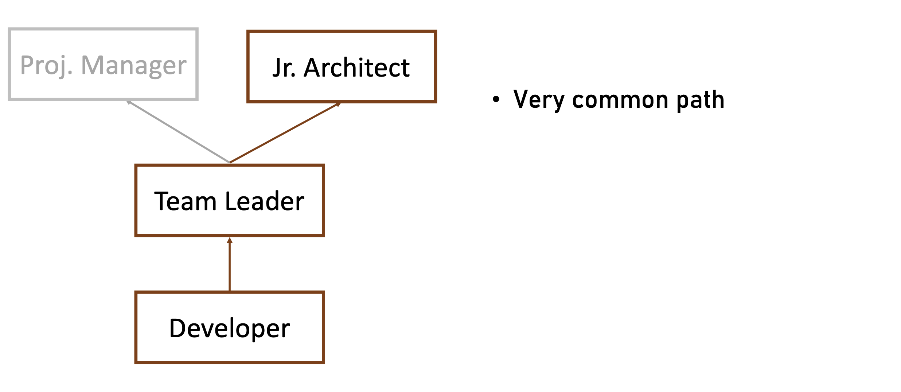
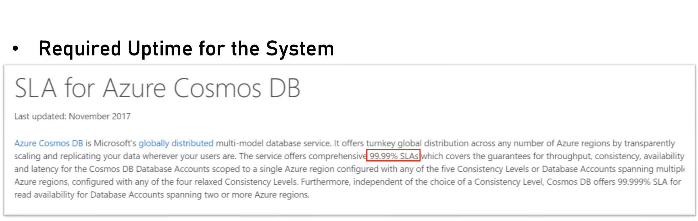
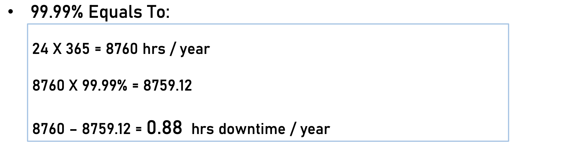
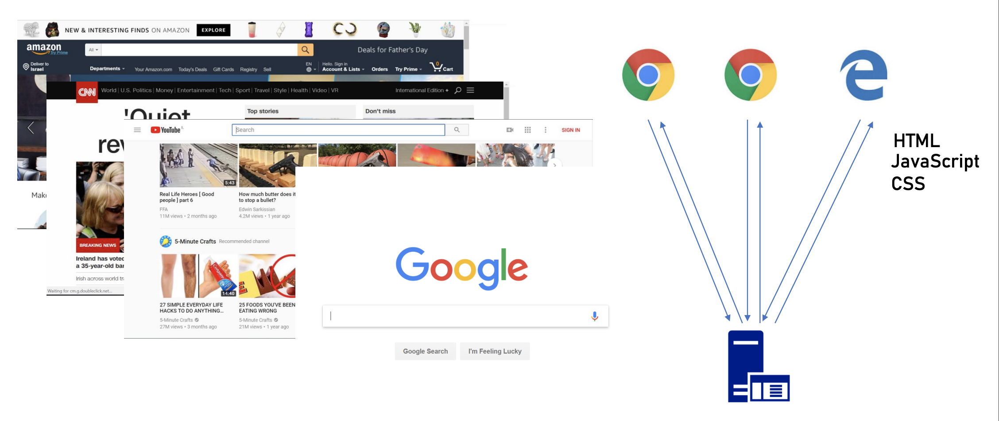
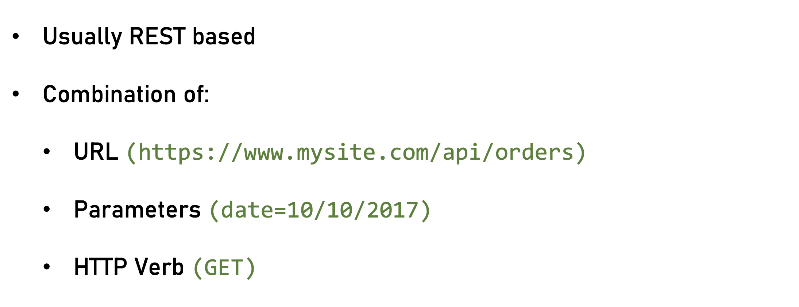
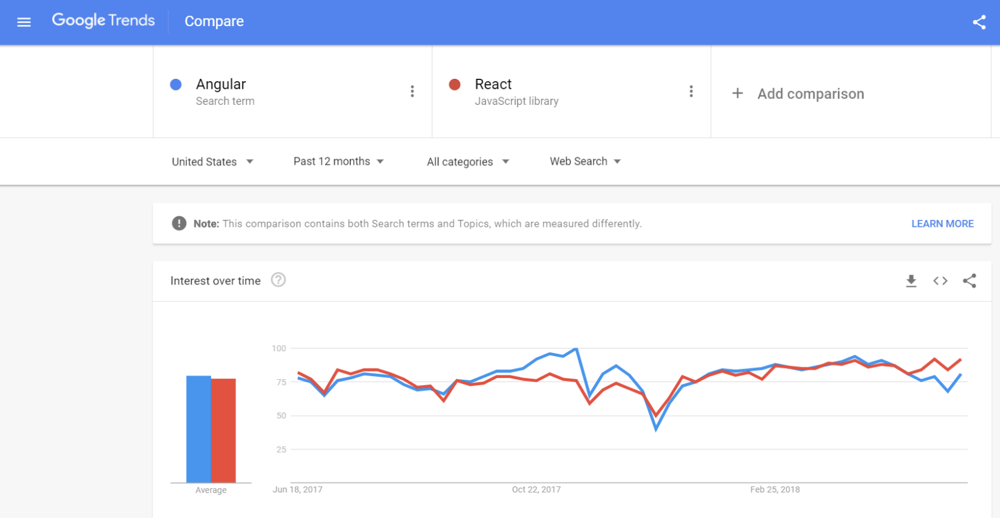
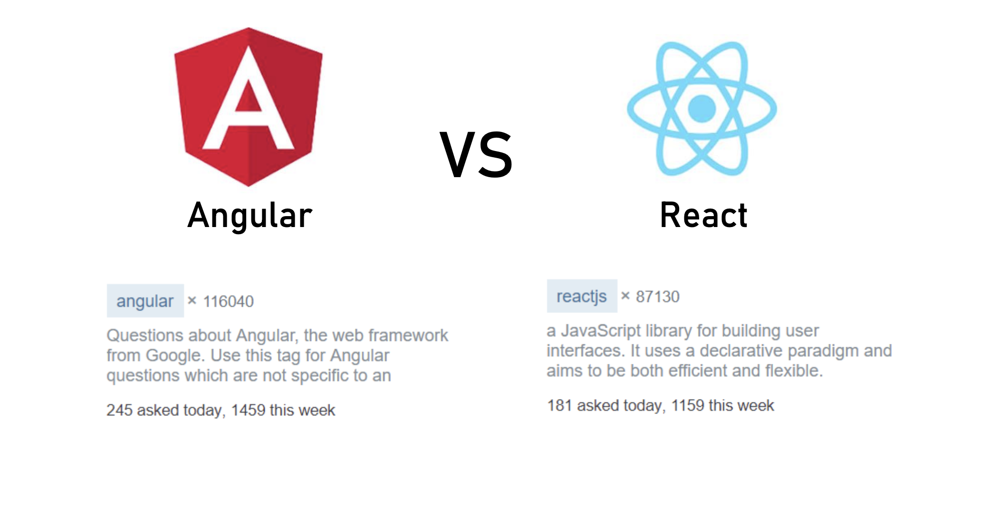
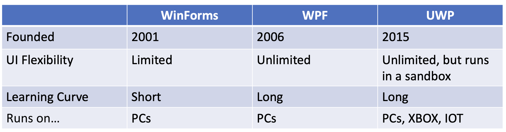

## The Complete Guide to Becoming a Software Architect
### SECTION 1 : What is a software Architect
1. **Types of Architects**
    * **Infrastructure Architect**  
        The infrastructural architect is responsible for designing the infrastructure of a given system, and by infrastructure, I mean all the Nan Software related elements such as servers, virtual machines, network storage, etc. 
        He's responsible for all this and also to make sure they work nicely with the system, developed the infrastructure architecture to be familiar with the systems requirements so he can make sure the infrastructure he designs will support those requirements.
        For example, if the system is expected to grow by three terabytes annually, the infrastructure architect should make sure the storage for the system will be able to handle this load. The career path for infrastructure architect goes through infrastructure experts. You have to be well versed in infrastructure, design, implementation and configuration in order to become a good infrastructure architect.
    * **Software Architect**  
        the software architect sometimes called also solution architect or system architect, is responsible for the architecture of the software
    * **Enterprise Architect**  
        the enterprise architect Rook's, with the top management of the organization to make sure the idea of the organization is an enabler for the business and not a hindrance.
        In many organizations, business decisions such as starting a new sale or entering a new business field, is held back by the ATI, which needs time to adapt to the new requirements. The enterprise architect usually walks with the CEO and CIO of the organization to find out what are the main bottlenecks, what holds back the waiting and how it can be streamlined to support business continuity.
        Since the enterprise architect operates at a very high level in the organization, he has almost no work relations with development oriented roles such as developers and team leaders. In order to become an enterprise architect, one has to be first a senior software architect or an experienced project manager. As I said earlier, the enterprise architect is not very technical, and you don't always have to have a practical hands on experience in order to become one, although it's definitely a plus.
2. **Responsibility of the Architect**  
    What do we need an architect at all? 
    The short answer is this developer knows what can be done.
    Architect knows what should be done.
    A senior developer knows the technology very well, knows what is the best way to implement loops, how to perform operations efficiently, what libraries to use to access a database, and so on. A software architect is also quite familiar with the technology platform, although not as much as a developer. But his main goal is to make sure the software design implements the requirements of the system.  
    **a software architect is someone who designed the system to be fast, secure, reliable and easy to maintain and select the optimal technology platforms and patterns to achieve these goals.**
3. **The Architect in the Organization Chart**  
    I want to emphasize a point architect is not and should not be a managerial position. S/he does not hire and fire. S/he does not manage vacation requests and definitely not conducting performance reviews or compensation negotiations. The reason for that is that the architect is a professional and has a lot to deal with. It is not a good idea to mix all her responsibilities with management tasks.
    
    The first chart demonstrate an organization chart with a dedicated architect for each project.  
      
    This is a typical, though very simplified chart with the architects are junior ones. In this scenario, the architect sees the bigger picture, but only of the project they are not involved with. Other project is organization and the contribution is quite limited.

    The second chart demonstrate architect reports directly to the CIO.
      
    This is usually the case with senior experienced architects, which have proven themselves valuable to the organization and which has a tremendous added value at the organization level and not just the project level.
4. **Architects & Code**
    * Architectural trustworthiness as an architect.  
        You are going to design an architecture which utilizes certain platforms in patterns, you have to make sure the architecture is feasible and the best way to do it is to try and implement it yourself.
        Yes, that's not a mistake. You have to be able to implement certain parts of the architecture in order to test them before expecting the developers to implement the unimplementable.  
        **for example.**  
        Are you going to recommend using a certain dependency injection package tested in a small application and make sure it's actually do what you expect it to do? Are you contemplating whether to use analytical database or stick with a traditional RDBMS? No problem, installed both on your machine and test them out. This is the only way to make the architecture trustworthy by testing it beforehand to ensure your design can be implemented effectively and easily support the developers.
    * Support the Developers  
        One of the hardest tasks of the architect is to make sure the architecture is actually implemented. The best way to do that is to provide an ongoing support to the developers. The architect must be able to help developers when they get stuck while implementing the architecture and Ximenes, the developers work to detect deviations from the intended implementation. If the architect does not possess coding skills, he won't be able to review the code and locate those deviations.
    * Respect  
        If the architect is perceived as someone who has no idea what the developers are actually doing, they will think of him as a snob, arrogant and detached, and will immediately lose respect for him. If, on the other hand, they will see you sitting with them, helping them solve problems and listening to them, they will appreciate you as a down to earth practical and an all around nice guy and will be more than happy to listen to you in the future and discussing architectural topics and tasks.
5. **Architects & the Academy**
    * No dedicated degree for Architecture
    * CS Degree won’t hurt
    * Some courses and certifications exist (TOGAF etc.)
    * Usually geared towards Enterprise Architecture
6. **Career Path for Architect**
    The Common path for be architect
  
### SECTION 2 : The Architect’s Mindset  
1. **Understand the Business**  
    The really important lesson here is that in order to be of any value to the organization, you have to have a deep understanding of the organizations business.
    You have to understand what its **weaknesses** and **strengths** are. Who are they **competing** with in what is a **growth strategy**?  
    always understand the business before you begin walking on the architecture.
2. **The System’s Goals**  
    Now, it's important to note we are not talking here about what the system should do.
    These are not goals.  These are requirements.  
    And it's important to distinguish one from the other when talking about goals. We are talking about the effect the system will have on the organization. This effect can be almost anything, but it should be clear how this will affect the bottom line of the organization.  
    **We must know what is the environment our system is going to be operating in and what are the main tasks**  
    * Example 1
        System : HR System  
        Organization:  Product-Oriented Company  
        Goals: Streamline the Recruitment Process 
    * Example 2:
        System: Reporting & Mapping Criminal Incidents
        Organization: Large City
        Goal(s): 1. Improve Police’s Response Time, 2. Attract New Residents
    * Example 3:
        System: Mobile Flash Sales
        Organization: Young & Small Startup
        Goal(s): 1. Generate Quick Revenue Stream, 2. Attract Investors
3. **Your Client’s Clients**  
    It means that your mindset should be geared towards your client's client. It means that with every decision you make, you must ask yourself what will be the effect of this decision on your client client? It means that the comfort of your client's client is prioritized over the comfort of your client.
4. **Watch Your Language**  
    always keeping in mind what is the thing that really matters to the person you are talking to. If you can adapt to language to the best interests of the person we are talking to, you will be able to achieve much more.  
    **Example the project manager** :      
    Sophie, because only for the project success, she doesn't care what technology will be used or how amazing the architecture is. When you talk to her about your plans for the architectural, always emphasize how it will contribute to the project's success.
    Avoid sentences like this is the latest and greatest pattern and will be the first to test it out.  
    This sentence will only frighten her and she will immediately imagine how this untested technology will cause delays and compromises down the road.  
    Instead, try something along the lines of this.
    New technology can help us write the code twice as fast so we can cut our schedule and budget accordingly.  
    **Example the Team Leader** :  
    That is a hard core geek and he just loved programming. He spent at least one hour every night reading through technical blog posts, and he always up to date with the recent development in software industry. If you want to bring Dave on board and make him a strong proponent of your architectural talk to him using a technical language, tell him. 
    Listen, Dave, have you heard of the latest angular version? We are going to use it or, you know, function as a service are pretty cool. What do you say? We will give it a try in this project? Just says there will be more than happy to work with.  
    **Example the CEO** :  
    The last person we look at is surely the CEO, Chile is a very business oriented person and she always looks for the financial bottom line.  
    If you want to explain her, what are the advantages of the architecture you are working on? Never mentioned technical buzzwords.    
    Chile, the kind of person that when his medical services or kissing or even Gever, she immediately loses interest and stops listening. However, if you will tell her this, the architecture of design will ensure the continuity of the business and will be able to cope with the high load expected during Black Friday sales.
### SECTION 3 : The Architecture Process
    in order to make the architecture as useful as possible and to provide the maximum value to the client, the architect should follow. A well-defined roadmap set at the end will lead to practical and well-thought-of architecture, which will ensure the system is fast, secure, reliable and easy to maintain.  

**the steps in the architecture process.**  
1. **Understand systems requirements**  
    the requirements, describe what the system should do. The usually begin with high level tasks, such as allowing users to view telemetry data and often describe also workflows, logical services and user interface elements. Those requirements are usually defined by the system. Analyst works directly with the client. So in most cases, your first walk meeting after the obligatory introductory meeting will be with the system analyst.  

2. **Understanding non-functional requirements**  
    not functional requirements of a special kind of requirements that define some technical and service level attributes of the system.
    For example, the most common non-functional requirements are about concurrent, no refusals, heavy load volumes of data and performance. As we will see in a later section, the client and the system analyst are usually not aware of the non-functional requirements, and it is the architect's job to help them formulate those requirements.
    For us, the architects, the non functional requirements are much more important than the regular requirements.
    I never begin to work on a system before knowing exactly what it's non-functional requirements are because so many architectural elements can be affected by those requirements.

3. **Map the components**  
    the various components of the system, the components of the moving parts of the system that represent the various tasks of the system, functional as well as non-functional. The component map serves two goals, it helps you understand the system and its various parts. It's a great way to communicate to the client your understanding of the system, thus making sure you are not missing anything.
    Note that the component is completely non-technical.
    You are yet to decide on the platform, the development tool, the database type.
    This is just a map that displays the various capabilities of the system.
    Map the various software units in the system and define what each of them does.

4. **Selected technology stack**  
    This is one of the most important steps in this process, in this step, you are going to decide, together with the development team, what will be the platform on which the system will be based.Usually, there will be more than one technology to be used in most systems. You will have to select the backend platform, the front end platform in the DataStore platform. In addition, in some systems such as walls that are based on medical services, architecture, you will often select multiple bakin platforms and perhaps also multiple data stores, as we will see in the relevant section. There are a lot of factors you have to consider when selecting the technology stack, and the selection must be very rational irungu technologies that can lead to failure of the whole system.
5. **Designs the architecture**  
    This is the heart of your walk. You already have the requirements, the non functional requirement, the components in the technology stack.All that's left is to design the architecture that will glue all those together and will result in a system that is first secure, reliable and easy to maintain. We will learn about the qualities of a well-designed system such as loose coupling statelets, scaling, caching, messaging and lots more, and see how those qualities are used as the building blocks of the architecture. When you are done, you will have a complete architecture in place, but it would be formalized yet. Which brings us to the next step.
6. **Write right architecture document**  
    This is a culmination of all the effort you've put into the system and this is your greatest creation. The architecture document describes the whole process you have been through and gives the developers and management a full picture of the system that is going to be built. A good architecture document is relevant for all the levels in the organization, the CEO, the CIO, the project manager and of course, the developers.  
7. **Support the development team.**
    A lot of architects believe their job is done once the document is delivered. huge sort of architectural is a living, breathing creature, and it changes all the time. You have to be there for the developers to help them to make sure they are developing according to the architecture and to be part of the dilemmas that are going to be raised. So you have to support the team if you don't want the documents to become a glorified paperweight. And remember, you are not done until the system is in production. And even then you probably will have a lot to do.
### SECTION 4 : Understanding System Requirements  
1. **Funcational Requirements**
    The System Analyst is the one that defines the functional requirements.
    * if the requirements answer the question what the system should do, they are functional requirements. Functional requirements are, of course, extremely important in no system should be designed and built without them.  
    For example : What are the business flaws of the system? For example, log in storing photos, receiving and crunching telemetry data and more. What business services should the system have, for example, local service, data, access service, telemetry receiver, telemetry control. What does the user interface of the system looks like, the look and feel, general guidance, responsiveness
    * Many architects feel they only need to skim over the functional requirements and concentrate on the nonfunctional ones. That's a mistake to remember our definition of the architecture.
    good architecture must improve the business bottom line.That won't be possible if you are not sure what the system should do.

2. **Non functional Requirements**  
    these requirements answer roughly this question what should the system deal with ?
    Describes the values aspect of the systems operation and are not tied to a specific behavior or logic. The most common non-functional requirements are performance load, data volume, concurrent users and
    For Example : what would be the maximum size of the data received by the service. if the size is going to bu huge this is non-functional requiremnt, for example 600 mb is completely different story for a pplication. 
    there are alot of [non-functional requirements](https://en.wikipedia.org/wiki/Non-functional_requirement)  
    * **Performance**
        What is the required performance for this system first?
        1. in this case architect should always talk with numbers.
            the most important thing is to walk out this number together with a client or system analyst. you should talk about response time of the tasks and try to take numbers from them even you should help them about numbers
        2. second should always specify latency and throughput.
            Latency answers the question, how much time does it take to perform a single task in the application?  
            For example, how much time will it take for the API to set the user data in the database?  
            Or how much time will it take to read a single file from the file system?
            You can see that latency deals with the time it takes to perform a single task throughput.
            On the other hand, throughput is a completely different question, it interests the task count will be performed in a time unit
            how many tasks can be performed in a given time unit?  
            how many users can be saved in the database in a minute?  
            how many files can be read in a second?  
    * **Load**  
        the load on functional equipment defines what it is, the load or quantity of the application you have to with stand without crashing. The exact definition of low depends on the exact type of the application.
        For example, for a Web API based application, the load will usually be defined as how many concurrent requests are going to be received by the system without crushing.
        Note that this requirement looks similar to throughput, which defines how many requests can be handled in a specific time unit. The difference between the two is that way.
        * Throughput defines the time unit.
        * The load defines the availability of the system, meaning the system should be able to handle the load without crushing down.  
        For example, the performance requirement can dictate throughput of one hundred requests per second, but the system should be able to handle 500 concurrent request without crushing, even if those requests will take more than a second to complete. This definition is important, since the worst thing that can happen to a system is to crash under heavy load.  
        Users can tolerate a slowdown when there is a load, but they won't like it if the system will crash and burn. So the best practice here is to always look at peak numbers.  
        For example, for an e-commerce website to regularly load might be up to two hundred concurrent requests. But on Black Friday we are looking at more than 2000 concurrent requests. In that case, we should plan for the extreme case because this is when it's more important for our system to be alive and functioning.  
    * **Data Volume**  
         this requirement defines how much data in gigabytes or terabytes or system will accumulate over time. This requirement is important for a few reasons.   
         * It will dictate what kind of database we are going to use, since not all databases can handle large quantities of data equally   
         * it will also determine what type of queries we are going to write because a query in a table of 100000 rolls will be completely different from a query in a table of 100 million rolls. And of course it will help us plan ahead.  
         The storage we need to allocate the data volume usually has two aspects.
         * One, how much data is required on day one?  
         * And two, what is the forecasted data growth?   
         For example, the system might need 500 megabytes on its first day and is expected to grow by two terabytes annually. Of course, the growth period can be different and can be weekly, monthly, quarterly and so on.

    * **Concurrent Users**  
        * This requirement defines how many users will be using the system simultaneously.  This requirement is quite similar to the law requirement, which also defines how many requests should be handled by the system simultaneously.
        But with one big difference;  The concurrent users requirement describes how many users will be using the system, not how many users will be performing requests.
        * This distinction is important when a user is using a system. There are a lot of dead times when no action is actually taken.    
        For example, a user is asking the system to display all the data. The system executes an API that goes to the database and retrieves the data. This is an actual action. Now the user is looking at the data. During this time, the system is doing nothing. The API is not working. The database just sits there and the network is silent. So as you can guess, systems that can hold 500 concurrent requests will be able to withstand a much higher number of concurrent users.    
        * The rule of thumb is that concurrent users are 10 times the number of concurrent requests. So if the system should work with 500 concurrent requests, it can support 5000 concurrent users. But this number actually depends on the type of system.
    * **SLA**  
        * the Service level agreement, describes what is required uptime for the system in percentage. This term is widely used by almost all public cloud providers. One of the biggest competitions between them is on the SLA. 
          
        For example, as customers, Deby takes pride with its ninety nine point ninety nine percent SLA. This is translated to less than an hour of downtime in a year. Take a look at the numbers.
         
        The SLA has great influence on the design of the system.  
        For example, a system that cannot be brought down must have a sophisticated uplink mechanism that won't require tuning of the system while it's operating. This is possible, of course, but it has to be designed this way. One important thing to note about this is client expectations.  
        * If you will ask the client what is required for the system, he will usually give you an answer along the lines of one hundred percent of the famous five nines, which is ninety nine point ninety nine percent. When this happens, you should usually tell him, no problem for this, we will need to build at least three data centers in different continents with independent and dual power stations in automatic fill over  between them.
        * What do you say?  
        This generally brings him down to earth and we discuss more realistic SLA goals. So these were the most common, non-functional requirements you will need to have for the system. And again, never start working on the architecture before you have set those requirements.

2. **Who Defines Non-Functional Requirements?**  
    * One of the biggest problems with the no functional requirements is that it's not clear who should define them.
    Usually we expect the client together with a system analyst, to define the functional requirements.  
    * when asked what is the essence for the system, assuming he knows what an athlete is, the client will usually say always when asked What is the required response time for the API? The answer will be someone 10 milliseconds.
    So we the architects of the rules in the functional requirements discussion. The first is to frame the boundaries, we must explain the client that 100 percent uptime is not realistic and probably not really needed.
    * We must explain to him that his current network will not enable completing an API call in less than one hundred milliseconds. And after we have done all this, we can talk about possible values in this discussion must be backed by real numbers.  
    For example, when talking about concurrent users, try to calculate the real number of concurrent users. Don't pull numbers out of a hat. Also, try to set realistic goals for the performance requirement. Remember, if the system is going to be used by end users, you don't need to fight for every millisecond.

### SECTION 5 : Application Types
* Welcome to the application types section in this section, we will discuss the various application types an architect will walk with one of the first things an architect should do when walking on a system to determine what kind of applications the system is going to be. This decision is usually made after walking on the requirements. Is a functional or nonfunctional.  
* In this phase, you have already learned what can be learned about the functionality of the system and the environment it will be operating in. And you can make an educational decision about the type of applications that best fit these requirements. This is an important decision since each type has its own pros and cons. Moreover, once a decision is made, it's usually not easy to switch to other types. 
#### Back-End Technologies
The most common application types are 
* Web apps, Web API, mobile console, service and desktop.  
1. **Web Apps**  
Web is probably the most common application type nowadays. 
Second, maybe only to Web API, Web ups, also known as websites, are basically the way the Internet worked since its inception with Web apps. There's a Web server, usually more than one, and a Web browser, though, to communicate with each other via HTP protocol.
Although other protocols can also be used, the browser sends and HTP request for the server asking for a resource. The resource in this case is an e-mail page which gets returned to the proposal, which in turn renders it for the end user. Almost always the e-mail page.
  
We use JavaScript code for implementing logic in the browser and files for the visual design of the page web are best for systems that require 
* user interface for end user 
* user initiated actions, meaning the user is the one making the request to do something such as viewing ordinator, sitting username and so on 
* large scale with a large number of users and a lot of data 
* short focused action as opposed to long running processes.    
For example, Web apps are not a good fit for a process that should crunch billions of numbers and produce business intelligence. For this, there are other kinds of applications. As we discussed earlier, we spoke inadequate response model, which is perhaps the most important aspect of them. 
As a rule of thumb, if the system you are walking on can be described as a request response application, then you are probably looking at a web.  
2. **Web API**  
Web API is quite similar to whip up with two important differences. One, it does not sort of HTML pages, but data, usually in the form of some structure to its clients, are not Web browsers.
But other applications, including JavaScript code that runs inside Web browser with API has become extremely popular in the last few years, and almost every Web expose also will be API.
In addition to the more traditional Web Web API, as its name implies, exposes an API application programming interface which allows other programs to access it and execute various actions. There are various types of web implementation, but the most popular one by a large margin is definitely the risk.
API recipe is a huge topic with a lot of philosophy in the thinking.But for this course, it's suffice to say that risk allows us to access entities with the combination of your URL parameters and http verb.

For example, 
* GET https://www.mysite.com/api/users/17
* DELETE https://www.mysite.com/api/orders/156

the following you will be executed by the API as get me user number 17. This all means delete total number 156, as you can see, the main advantage of rest is that it does not require more than a standard. We are able to execute API and it does not require cumbersome protocols on top of the HTP protocol, as was with the protocol. For those of you who are familiar with it, webpages are used for data retrieval and receiving it should not be used for returning visual markup such as HTML.  
For this reason, almost any kind of application can be a client of Web API, any code that can access Riced API. And I believe that almost every language supports that capability can access the API and use it. This is the reason that Web sites are used by Web apps, rich client apps and of course, Azel Systems. 
Web applications are built for systems that require 

* data retrieval install, though not huge amounts of data.
* Client initiated actions, meaning the caller is the one making the request to do something such as getting all the data saving username and so on 
* large scale with a large number of users and a lot of data 
* short focused action as opposed to long running processes with API.

And the Web apps are built on the same concept and usually shares the same underpinnings. So as with Web apps where Beppo also works best in the request response model and should be used for this kind of systems, long running processes should be avoided when using Web API.

3. **Mobile Apps**  

    Well, I guess you can guess what this tape is all about, mobile apps, as their name suggests, are apps that run on mobile phones, specifically smartphones, probably Android powered or iPhones.  

    Modern mobile apps connect with the webpages all the time for multiple purposes, logging, loading,
    next level, storing, user generated content and much more. Actually, there are not a lot of mobile apps, perhaps only games that can function properly without Internet connectivity.  

    Mobile apps will be used mainly for apps that require 
    * user interaction, for example, games or social apps. 
    * Front end for Web API application for displaying various types of content, for example, news and apps that are 
    * location sensitive and will benefit from the phone's GPS.  

4. **Console Applications**  
    Council applications or loan applications, often called Scilly are applications that run inside the  command line of the operating system. These applications have few common characteristics. They do not have any fancy UI.

    This configuration can be set also vehicle modeling parameters. They can trigger a long running process as well as execute very short, focused actions. The applications are used mainly for executing long running processes that do not interact with the end user and short focused actions such as exporting data that would be used by specially trained power users.   
    It's important to note that, in fact, the application is also application, does not change anything to its architecture or the architectural patterns and practices apply also to consider applications.

5. **Services**  
Services are quite similar to consular application with two important distinctions, they have no user interface at all, as opposed to the command line window in the control application, and they are managed by a service manager, which is a feature of the operating system that manages the services in Windows. There is one service manager while on Linux there are a handful you can choose from.  
The service manager starts and stops the services and also monitors the activity. Since services cannot ask the user about their behaviours, they will usually have a configuration file containing the required parameters.  
Services are used for long running processes, such as monitoring folder on the disk when no user intervention is required.

6. **Desktop**  
    Desktop applications are the poor boys of the app world, in a world where web apps and clouds are all the rage, almost nobody talks about desktop apps and for good reason.
    Desktop apps are applications that run mainly on the PC. It's important to differentiate it from rich client apps that access Web API and only a thin visual layer above the data.

    I'm talking here about an application that has all its resources, including logic and data on the local PC.

    This application might be using the Internet for some arbitrary tasks, such as validating license or sending activity logs, but it will still be fully functional when offline. Another aspect of desktop application is its UI or user interface.
    Desktop apps are targeted for end users and they will usually have a great user interface.  One good example of such an application is Microsoft Word, which works with or without an active Internet connection.

    Of course, you will lose some capabilities in offline, such as cloud connectivity, but it is still fully functional this way due to massive use of cloud computing and the ubiquity of Internet connectivity, desktop apps popularity is dwindling.
    You will use desktop apps mainly for user centric actions such as word processing or calculations and heavy gaming.

7. **Lambda**  
one of the hottest trend today is function as a service implemented by the likes of LAMDA or Azure functions, which allows the developer to write a short, focused code segment and not worry about surveiled scale.

8. **Summary**  
Applications built on these functions are not Willoughby's or website and represent a new type of applications.
But still, most apps today fall into the categories we discussed.
One of the first tasks you will have when beginning work on a system is to determine which application type is best suited for it. Often, system will comprise of more than one application and you will find yourself mixing and matching various types in a single system.  
For example, many web apps have, in addition to the main application, also is services that run continuously and performs maintenance tasks such as removing all data records, monitoring various processes and so on. This is quite common and you will probably encounter these type of systems in your job.

#### Front-End Technologies
* front end is a part of the software that is viewed by an actual user with his own eyes. This is where we will display bottomless text, dropdown list, colors, messages and more. So, naturally, when selecting a floating technology, we would like to select something with robust visual capabilities, but something that will not make us work too hard.

* **Web apps**
    * Web apps definitely with defined Web apps as applications that run in the browser and display it to the user. We definitely have a front end here.

    Web apps, web apps by definition have Web based front end, which means we are going to use a combination of JavaScript and services is the real question here is which JavaScript framework are we going to use?

    The most popular frameworks at the time of this recording are **Angular** and **React**. There are other great candidates such as refugees, but I really want to focus on the most popular ones with the largest communities.
    
    So first, let's compare Angiulo and React popularity. As you can see on Google Trends, they are quite similar in popularity. 
    
    Looking at stackoverflow.com, we can see there are more questions regarding ungulates and those regarding the act. But since Angulo is older, it was founded on 2010 as opposed to 2013, the numbers are actually quite close.

    * **Angular**  
        Angular is a full blown framework with a full set of capabilities frontend framework will need, such as data binding state management, routing services and lots more learning. and will. I can take time and it won't come easy even to developers with a lot of experience in Web development.  

    * **React**  
        React, on the other hand, is more libraries than a full feature framework. It focuses on the user interface side and is great at it. If other capabilities are needed than separate libraries should be used. On the other side, react learning curve is much shorter and Web developers can get up to speed with

    it in a matter of days, while angular training can take a few weeks, if not more so. If you are looking for a one stop solution for all your web front needs and you have the time for training, opt for angular. Otherwise go for react.

* Mobile Apps need an UI  

    When designing mobile app, the first thing we need to do is to decide the development approach we are  going to use. There are three main approaches for mobile app development, native hybrid and cross platform. Basically, those approaches represent a trade off between development time versus capabilities and your selection should be based on these factors. 

* **Native apps as an answer.**  

    Just use the native development platform for each mobile platform.                                          For example, native iPhone development can be done using objectivity or the swift language with the development tool and using the iOS SDK. Android apps, on the other hand, are developed mainly with Java using Android studio and the Android SDK.
    As you can see, AOS is native. Environment is completely different from the Android one and you will have to have developers that expertise in each one of those environments. On the other hand, native of a full access to all the field capabilities, including camera, accelerometer, Bluetooth, filesystem, text and more, you are not limited in any aspect and you can take advantage of any feature you would like.
    In addition, native apps are very responsive and will offer the best user experience.

* **Hybrid apps as an answer.**  

Hybrid apps of the complete opposite of native apps happy to provide native rubber, usually with tools  such as a phone app. And in it you will find a regular webpage complete with JavaScript and see if you can think of it as Iglauer. Fight Browsr with limited phone capabilities, but it's still a webpage and requires Internet connectivity, accessing phone capabilities such as accelerometer or COMILLA can be a challenge without having to endure a lot of limitations. In addition, happy to provide inferior user experience compared to native apps in the graphics, performance is limited. If your team knows how to develop web apps, they will know how to develop hybrid apps. It's that easy in the middle between the native and hybrid apps we find across cross platform apps.

* **Cross Platforms as answers**

The cost platform approach works like this. The development is done in a specialized environment not linked directly to any of the mobile platforms, the leading growth platform environments. Today, al-Samarie and React Native in summary, and you will develop in C Sharp using visual studio while in real native. The development is done with JavaScript using one of the many ideas supporting REAC native. After the development is done, you compare the application and the result is the native up for the selected platform. You will be able to compensate for iOS and for Android and get native apps for both of them without writing a single line of Java or objectives. So pros of using this approach are clear. We write the code once and it was on both platforms as native apps.   
What are the cons? There are a few.   
First, there is usually a government supporting latent capabilities of the native operating system and the cross platform tools always play catch up with the various mobile platforms.  
In addition, cross platform apps do not work well with heavy graphics. So if that is your plan, you will have to go to native apps. 
Last but not least for some scenarios, you will still have to resort to native programming, especially when accessing specific sensors. So in this case, this is not your cost platform.

* **Dekstop Apps**  
We have three options for desktop development WinForms, WPF and UWP . it's similar in concept to older platforms such as the basics and is quite limited in its graphical capabilities.
You can see the summary of the three alternatives you talked about with the main differences between them.

#### Data Store
Selecting the datastore technology is one of the more important decisions you will make in the product design. After all, this is where your precious data is going to be stored for the use of the application.
First, let's make an introduction with the two types of data still exist today.
1. **SQL Databases** 
     SQL databases or relational databases, all the more traditional databases that have been around for almost 40 years and have served the industry with the most popular relation databases are Microsoft, SQL Server, Oracle and MySQL relational database that have some common characteristics.
    * They store the data in tables.
    * Each table stores a specific type of entity, and each table has a concrete set of columns which represents the growth properties of the entities.
    * Tables can have relationships with each other. Hence the relational is the database name.
    * Another characteristic of relational database is transactions. A transaction represent an atomic set of actions that either executes all the actions or executes none of them. There is no way that only part of the actions in the transaction will be executed.
    For example, if the customer placed an item in the order, the items stock must be decreased by one. It should never happen that the item was placed, but the stock was not updated.
    * Transactions are defined with the acid acronym, which stands for atomically consistency, isolation and durability.  Only a database that supports all this can claim to support transactions. Transactions are one of the most important capabilities of relational database, and naturally they are widely used.
    * The last characteristic we will talk about is the querying language or the relational databases enable querying data using the sql language SQL, which stands for Structured Query. Language is a very mature language that was introduced by IBM more than 40 years ago. It allows querying and modifying data in an easy to understand language and is considered the de facto standard for accessing data in relational databases.
2. **NoSQL Databases**
    * As the name suggests, NoSql databases try to be the opposite of sql databases. One of the most significant limitations of SQL database is our performance and size. Since the relational database is maintained screamo for each record and enforced transactions, the performance, the grade of the database is getting larger and larger. This is a problem that no single movement is trying to solve.
    * The greatest strength of noSQL is a scale and performance, not equal. Databases can become really huge and they are often distributed on many servers. For example, Baidu, the Chinese search engine stores more than 300 terabytes or more could be one of the most popular NoSQL databases.
    * This is great if your application is going to store structured or unstructured data, which does not have a concrete schema. In this case, the flexibility offered by noticable database is a great advantage.
    * With NoSQL databases, transaction support is varied. Most databases support a concept called eventual consistency. Which means that the database guarantees that the action will be performed, but it will not guarantee when exactly it will be performed.
    * This means the court must be able to cope with temporary inconsistencies in the data.
    * Why would it not equal that support asset transactions?  The answer lies in the commission statement size and performance. As we mentioned before, transactions are what block relational database from reaching the level of performance required today by huge data consumers and creators.  In that way, NoSQL databases support only part of the ACA definition.
    * The SQL is a universal language and can be used on any relational database. On the other hand, there is no standard for accessing data in nautical database. Each database has its own language and driver and requires its own learning curve.  
3. So let's summarize.
* If your system is not going to be huge and by huge, I mean at least 10 of terabytes and the data is mostly structured. And if data consistency is important to go for traditional SQL databases, it doesn't really matter which of them you will take. They are all doing a very good walk.
* If, on the other hand, you are planning to have a huge unstructured data store opt for the NoSQL database.
* For example, traditionally nautical database were great acquiring Jason document, whereas Syckel databases, to put it bluntly, just sucked.
However, we can find today great jassam Korean capabilities in databases such as SQL Server and pottery. Actually, I have a client which decided to drop be in favor of SQL Server because he really liked the combination and offered a full protection support and Jason Query.
Another example is the aforementioned transactional support. Vulgarly has added full ACIN support a few months ago, which was a great breakthrough for the nautical database. 
They claim it won't impact performance and it will be very interesting to see whether other logical vendors will adopt this attitude.
### SECTION 6 : Application Types
